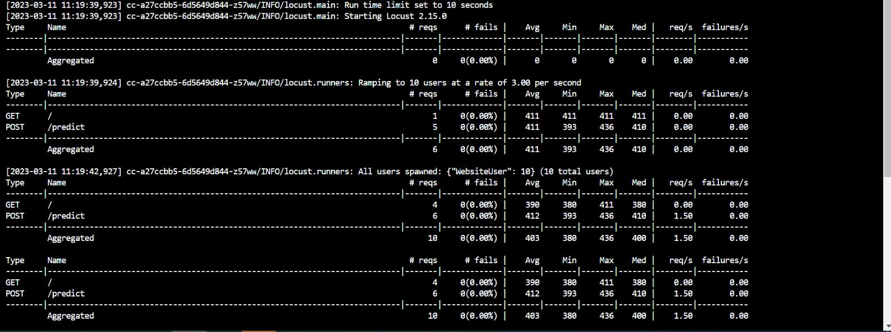
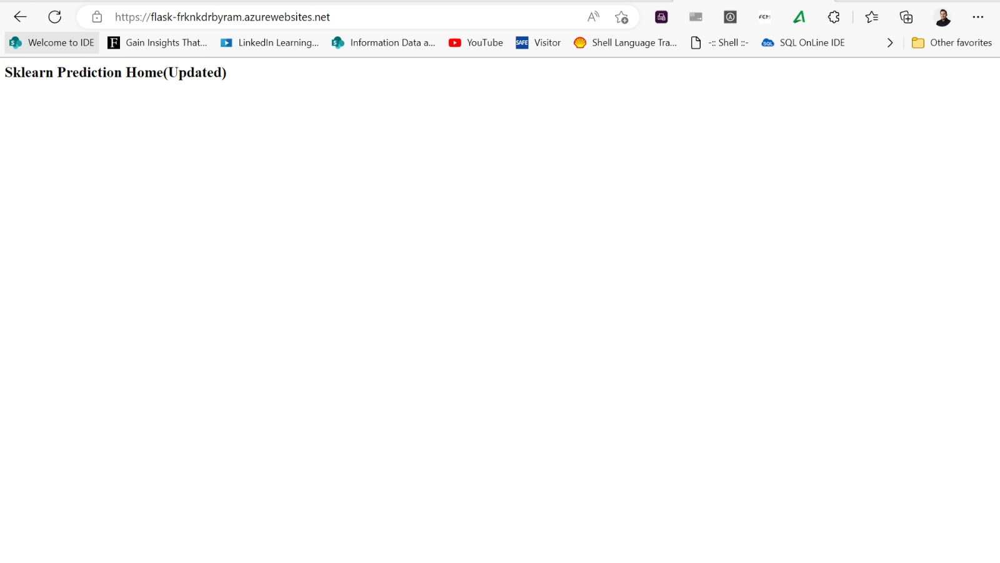

[](https://github.com/Frknkdrbyram/Azuredevops/actions/workflows/pythonapp1.yml)

# Azure DevOps Project: Building a CI/CD Pipeline

# Overview

This project describe the DevOps CI/CD concepts. using Azure pipeline and Github Actions for automating test, build and deploy web application. 

## Project Plan


* The [Trello board](https://trello.com/invite/b/dMheLlKL/ATTIffbfa752cbe23c4496af31b4660e6ec242D8FC0B/weekly-plan) is then used for task planning and tracking.
* The [quarterly project plan](https://github.com/Frknkdrbyram/Azuredevops/blob/cef9de0f865f2cb6acc85bdf362db90137c38079/PLAN%20CI-CD.xlsx) the steps for building CI-CD pipeline.

## Instructions
The below diagram shows the project architecture.  


The source code are in GitHub repo, actually GitHub Actions perform CI. therefore once any change happend on repo the GitHub Actions can atomatically check the code by build and test.

The code was cloned, build and deployed locally to Azure app serive.

Azure pipline perform CI/CD by pulling the code from GitHub, Build, Test and Deploy it to Azure app service.

### Cloning GitHub Repo and Testing Locally

open the Azure cloud shell by using your credential.

Clone project from GitHub and change to the project directory:
```bash
furkan [~]$ git clone git@github.com:Frknkdrbyram/Azuredevops.git
furkan [~]$ cd Azuredevops
```

Create python virtual env & source :
```bash
furkan [~/Azuredevops]$ python3 -m venv ~/.myrepo
furkan [~/Azuredevops]$ source ~/.myrepo/bin/activate
```


Install needed packages and testing it:
```bash
(.myrepo) furkan [~/Azuredevops]$ make all
```


Run the application locally:
```bash
(.myrepo) furkan [~/Azuredevops]$ flask run
```

Test the code locally in new Azure Bash:
```bash
furkan [~]$ source ~/.myrepo/bin/activate
(.myrepo) furkan [~]$ cd Azuredevops/
(.myrepo) furkan [~/Azuredevops]$ ./make_prediction.sh
```


### Provisioning CI using Github Actions
Performe CI by using GitHub Action.

From the top bar of GitHub click on 'Actions', then click on "set up a workflow yourself' and use the GitHub Actions template yaml file located in  [.github/workflows/pythonapp1.yml]

Once you create this workflow, it will run automatically to build code in Repo:


Passing GitHub Actions:


### Deploying to Azure App Services
Deploy app to Azure app services locally using Azure CLI:
```bash
(.myrepo) furkan [~/Azuredevops]$ az webapp up -n flask-Frknkdrbyram --sku F1 --resource-group Azuredevops
```

Check app if it is become online by using the link from the previous step:


Test the online app by invoke 'make_predict_azure_app.sh'  modify webapp name in the file
Edit file 'make_predict_azure_app.sh' and replace '< yourappname >' with your webapp name (e.g. flask-Frknkdrbyram).

Test the remote webapp:

Logs of webapp can be easily done by tail linux command:

open cloud shell 

```bash
(.myrepo) furkan [~/Azuredevops]$ az webapp log tail
```


validation of the webapp can be performed using [locust](https://locust.io).

Install locust tool 

(.myrepo) furkan [~/Azuredevops]$ pip install locust
Open Template file 'locustinput.py' and Replace '< yourappname >':
```bash
(.myrepo) furkan [~/Azuredevops]$ nano locustinput.py
(.myrepo) furkan [~/Azuredevops]$ locust -f locustinput.py --headless -u 10 -r 3 -t 10s
```




### Provisioning CI/CD using Azure Pipelines

This pipeline will get the code from GitHub Repo and do all operations building, testing and deployment.

Go to Azure devops from your Azure account  https://dev.azure.com.

Create a New Project.

Click on 'New pipeline' from the left panel.

Link your GitHub Repo to pipeline

Configure pipeline to deploy code to Azure app service 'that created in previous stage' by providing suitable inputs according to your Azure subscribtion

run the pipeline including the 'Build stage' and the 'Deploy Web App' based on yaml file:


View pipeline log by click on build icon


From now on every change to your code will trigger the CI/CD pipeline and update your webapp accordingly:

Change the application name in app.py from 'Sklearn Prediction Home' to 'Sklearn Prediction Home Edited' and commit it:

(.myrepo) furkan [~/Azuredevops]$ git add app.py && git commit -m "Change app name" && git push

App name before changing:


App name after changing:


The pipeline is triggered by each commit to GitHub Repo and actually that is the CI/CD


## Enhancements
Future improvements include but are not limited to:
* More test cases using pytest

* Preform automatically testing using testing module such as locust as script at the last step in deployment stage

## Demo

This video demonstrates all previous steps:
[Demo Video](https://www.youtube.com/watch?v=7WVkz0Brn0E)

